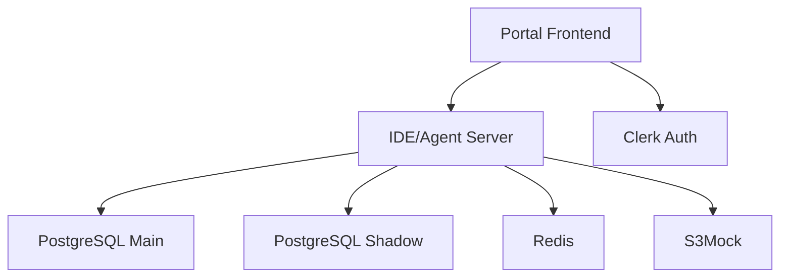

# Service Architecture

## Service Hierarchy

### 1. Infrastructure Services (Required)

- **PostgreSQL Databases**
  - Main DB (`localhost:5432`)
  - Shadow DB (`localhost:5433`)
  - Purpose: Stores spells, agents, and application data
- **Redis** (`localhost:6379`)
  - Purpose: Caching and pub/sub for real-time updates
- **S3Mock** (`localhost:9000`)
  - Purpose: File storage for assets and templates

### 2. Core Backend Services

- **IDE/Agent Server** (`http://localhost:3030`)
  - Primary backend service
  - Handles agent execution, spell management
  - Provides API endpoints for agent operations
  - Dependencies: PostgreSQL, Redis

### 3. Frontend Services

- **Portal** (`http://localhost:3000`)
  - Main user interface
  - Template gallery and management
  - Project management
  - Dependencies: IDE Server, Authentication

## URL Structure

### Development Environment

```
Portal Frontend: http://localhost:3000
IDE/Agent Server: http://localhost:3030
PostgreSQL Main: localhost:5432
PostgreSQL Shadow: localhost:5433
Redis: localhost:6379
S3Mock: localhost:9000
```

### Production Environment

```
Portal Frontend: https://app.magickml.com
IDE/Agent Server: https://api.magickml.com
```

## Service Dependencies



## Startup Sequence

1. Infrastructure Services: `npm run portal:up`
   - Starts PostgreSQL, Redis, and S3Mock containers
2. Database Initialization:
   - `npm run db:init` (Main database)
   - `npm run portal:db:init` (Portal database + templates)
3. Backend Server: `npm run dev:server`
4. Frontend Portal: `npm run portal:dev`

## Environment Configuration

The system uses several URL configurations that must be consistent:

- `NEXT_PUBLIC_APP_URL`: Portal frontend URL
- `NEXT_PUBLIC_API_URL`: IDE/Agent server URL
- `IDE_SERVER_URL`: IDE server's self-reference
- `APP_URL`: Internal portal URL
- `API_URL`: Internal API URL

For local development, these all use the localhost URLs shown above. In production, they use the corresponding production URLs.
