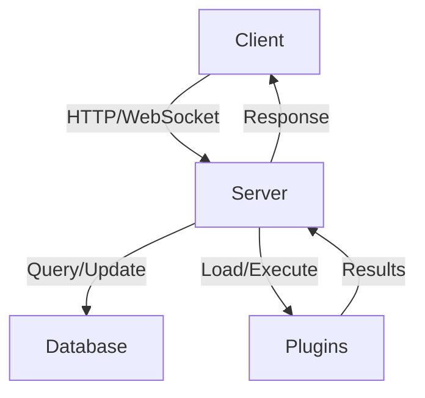

# Architecture Overview

## System Components

### 1. Frontend (Client)

- React-based web application
- Visual node-based programming interface
- Real-time collaboration features
- State management and data flow
- Plugin system integration

### 2. Backend (Server)

- Feathers.js framework
- RESTful API endpoints
- WebSocket support
- Authentication and authorization
- Database interactions
- Plugin management

### 3. Database

- PostgreSQL with pgvector extension
- Stores:
  - User data
  - Project configurations
  - Spell definitions
  - Agent states
  - Plugin data

### 4. Plugin System

- Modular architecture
- Hot-reloadable plugins
- Standardized interfaces
- Custom node types
- Service integrations

## Data Flow

## Key Concepts

### Spells

- Visual programming workflows
- Composed of nodes and connections
- JSON-serializable format
- Executable logic units

### Nodes

- Atomic processing units
- Input/output sockets
- Type system
- Custom implementations

### Agents

- Autonomous entities
- State management
- Event handling
- Multi-modal interactions

## Security Architecture

### Authentication

- JWT-based auth
- Role-based access control
- API key management
- Session handling

### Data Protection

- Input validation
- SQL injection prevention
- XSS protection
- CORS configuration

## Scalability Considerations

### Horizontal Scaling

- Stateless server design
- Load balancer ready
- Database connection pooling
- Caching strategies

### Performance

- Optimized database queries
- Efficient WebSocket usage
- Resource monitoring
- Memory management

## Development Architecture

### Local Development

- Hot reloading
- Development database
- Debug tooling
- Testing framework

### Deployment

- Docker containers
- Environment configuration
- Database migrations
- Health monitoring

## Integration Points

### External Services

- OAuth providers
- Cloud services
- AI/ML services
- Webhook handlers

### API Architecture

- RESTful endpoints
- WebSocket events
- GraphQL (planned)
- Plugin APIs

## Future Considerations

### Planned Improvements

- Enhanced caching
- Distributed processing
- Real-time collaboration
- Advanced monitoring

### Architectural Goals

- Maintainability
- Extensibility
- Performance
- Security

## Technical Specifications

### Technology Stack

- TypeScript/JavaScript
- React
- Node.js
- PostgreSQL
- Docker

### Development Tools

- npm/yarn
- Jest
- ESLint
- Prettier
- TypeScript

## Additional Resources

- [API Documentation](../api/)
- [Database Schema](../database/)
- [Plugin Development](../plugins/)
- [Security Guidelines](../security/)
