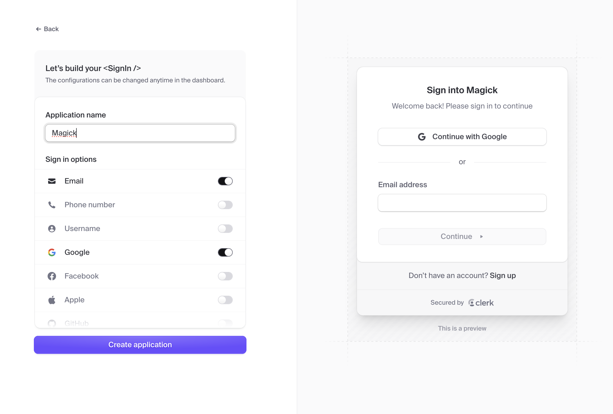
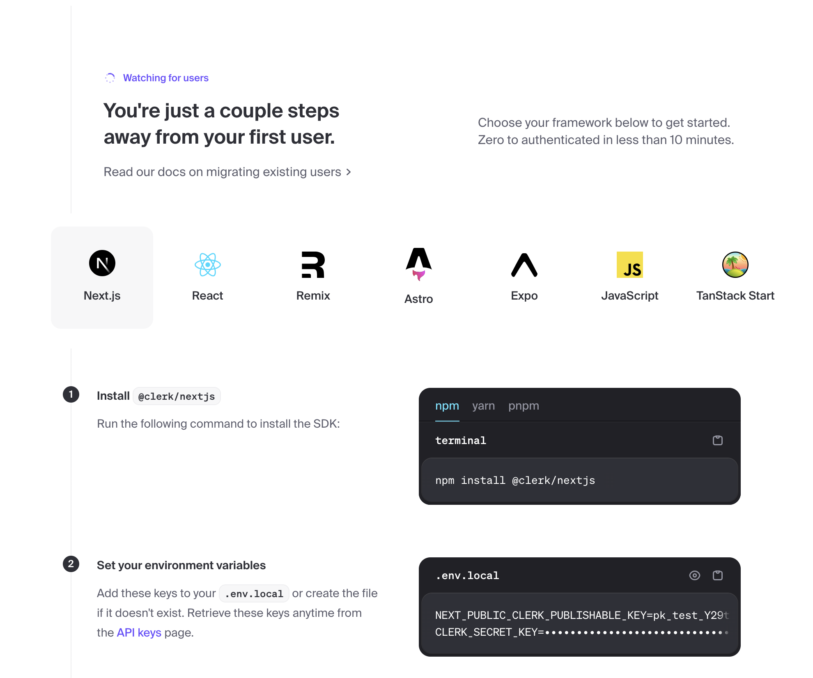

# macOS Installation Guide

## Project Architecture Overview

This project consists of multiple services that work together. For a detailed understanding of the service hierarchy and how they interact, please see [Architecture Overview](../architecture.md).

Key services that will be running:

- PostgreSQL databases (Main & Shadow) for data storage
- Redis for caching and real-time updates
- S3Mock for file storage
- IDE/Agent Server (port 3030) for backend operations
- Portal Frontend (port 3000) for user interface

## Prerequisites

1. **Homebrew** (Package Manager)

   ```bash
   /bin/bash -c "$(curl -fsSL https://raw.githubusercontent.com/Homebrew/install/HEAD/install.sh)"
   ```

2. **Node.js 18+**

   ```bash
   brew install node@18
   ```

3. **Docker Desktop**

   ```bash
   brew install --cask docker
   ```

   Start Docker Desktop from Applications folder

   > **Note for M1/M2 Mac Users**: You may see platform mismatch warnings for the database containers (e.g., "platform linux/amd64 does not match host platform linux/arm64/v8"). These warnings are expected and the containers should still work correctly. If you experience issues, you can enable "Use Rosetta for x86/amd64 emulation on Apple Silicon" in Docker Desktop settings.

4. **Python 3.11**
   ```bash
   brew install python@3.11
   brew link python@3.11
   ```

## Clerk Authentication Setup

Magick uses [Clerk](https://clerk.com/) for authentication. You'll need to set up a Clerk account and application before proceeding:

1. Sign up for a free account at [clerk.com](https://clerk.com)
2. Create a new application
   
3. Once created, copy the required environment variables
   
4. Add these values to your `.env.local` file in the next section

## Installation Steps

1. **Clone Repository**

   ```bash
   git clone https://github.com/Oneirocom/Magick
   cd Magick
   ```

2. **Install Dependencies**

   ```bash
   npm install --python=python3.11
   ```

3. **Configure Environment**

   ```bash
   cp .env.example .env.local
   ```

   The default development URLs will be:

   - Portal Frontend: http://localhost:3000
   - IDE/Agent Server: http://localhost:3030

4. **Start Infrastructure Services**

   ```bash
   npm run portal:up
   ```

   This starts PostgreSQL, Redis, and S3Mock containers. Wait a few moments for the services to be ready.

5. **Initialize and Seed Databases**

   ```bash
   npm run db:init        # Initialize main database
   npm run portal:db:init # Initialize portal database and seed templates
   ```

6. **Start Services**

   Start the backend server:

   ```bash
   npm run dev:server
   ```

   In a new terminal, start the portal frontend:

   ```bash
   npm run portal:dev
   ```

## Verification

After starting all services, you should be able to access:

- Portal Frontend: http://localhost:3000
- IDE/Agent Server: http://localhost:3030

## Troubleshooting

If you encounter issues:

1. Ensure all required services are running (check Docker Desktop)
2. Verify environment variables in `.env.local`
3. Check service logs for specific errors
4. Refer to [Architecture Overview](../architecture.md) for service dependencies
